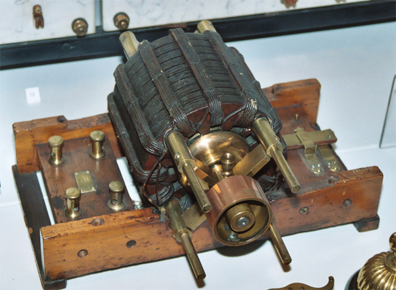
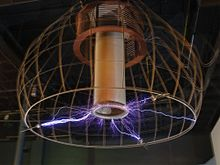
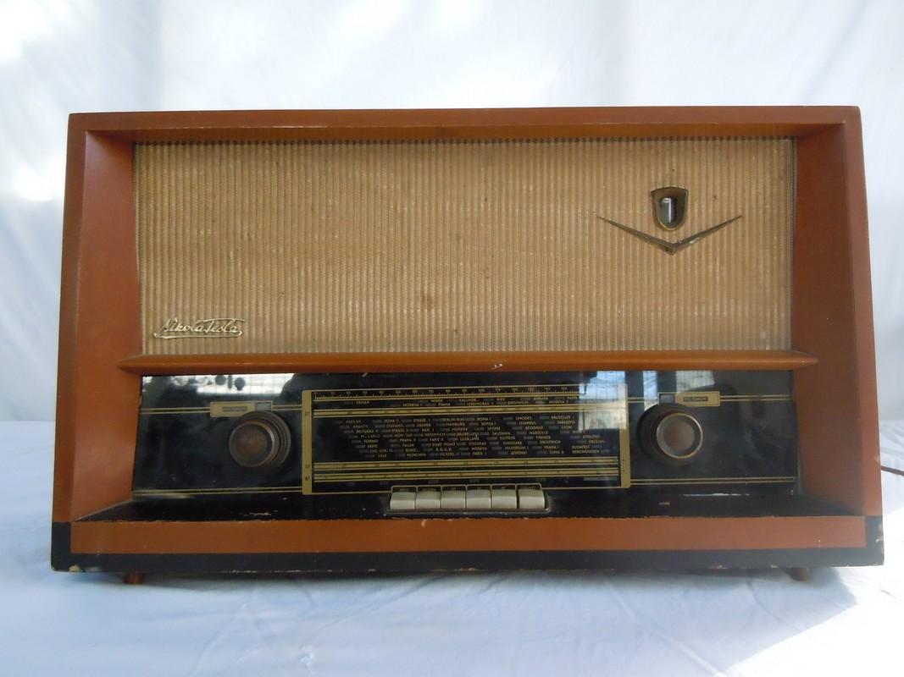
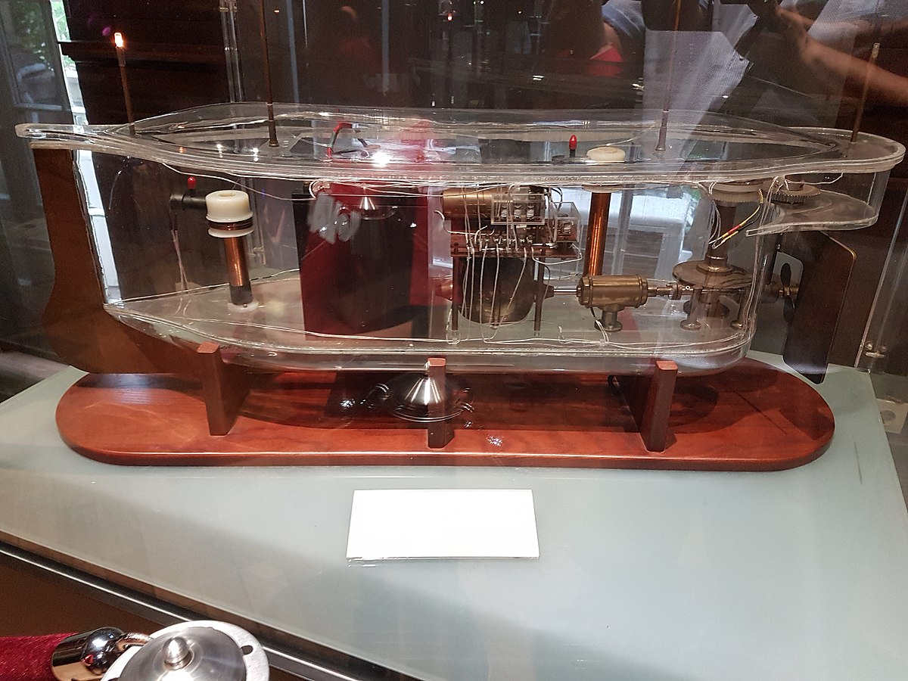
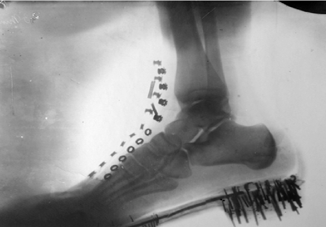
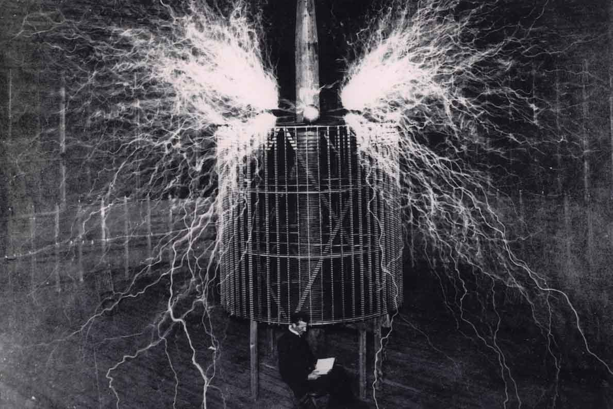

## La vie et les inventions de Nikola TeslaLes inventions de Nikola Tesla

#### MENU

- [Accueil](index.html)
- [Biographie](page1.html)
- [Inventions et Héritage](page2.html)
- [Tableau des inventions](page3.html)
- [Vie personnelle](page4.html)
- [Le décès de Tesla](page5.html)
- [Bibliographie](bibliographie.html)

[Le tableau des inventions les plus importantes de Nikola Tesla](#tableau_inventions) Lorem ipsum dolor sit amet, consectetur adipiscing elit. Duis ut justo et velit volutpat efficitur. Donec in bibendum lacus, sed volutpat eros. Praesent auctor quam non bibendum venenatis. Curabitur vitae vestibulum turpis. Nunc aliquam sagittis magna sed consequat. Pellentesque habitant morbi tristique senectus et netus et malesuada fames ac turpis egestas.

### Tableau des inventions les plus importantes de Nikola Tesla

Lorem ipsum dolor sit amet, consectetur adipiscing elit. Duis ut justo et velit volutpat efficitur. Donec in bibendum lacus, sed volutpat eros. Praesent auctor quam non bibendum venenatis. Curabitur vitae vestibulum turpis. Nunc aliquam sagittis magna sed consequat. Pellentesque habitant morbi tristique senectus et netus et malesuada fames ac turpis egestas.

| Invention    |   Description    | Image |
| :------------: | :------------- | :-------------: |
| Courant Alternatif (AC)       |     Le courant alternatif (AC) est une forme d'électricité qui change régulièrement de direction, ce qui permet une transmission plus efficace sur de longues distances.     |  |
|Transformateur     |  Un transformateur est un appareil électrique qui permet de modifier la tension d'un courant électrique.    |  |
| Bobine Tesla        |     Une bobine Tesla est un type de transformateur résonnant qui produit des arcs électriques haute tension et des décharges électriques.      |    |
| Résonance       |     Tesla a découvert la résonance électrique, qui a été utilisée dans de nombreuses inventions, notamment la radio.     |   |
| Radio     |   Tesla a travaillé sur la radio pendant de nombreuses années et a déposé plusieurs brevets importants pour cette invention.    |  |
| Télécommande        |     Tesla a inventé un système de télécommande qui a été utilisé pour contrôler des bateaux et des jouets.      |   |
| Rayons X       |     Tesla a travaillé sur les rayons X et a inventé un tube à rayons X amélioré.     |    |
| Énergie sans fil     |   Tesla a étudié les moyens de transmettre de l'énergie sans fil et a inventé un système de transmission sans fil.    |       |

Lorem ipsum dolor sit amet, consectetur adipiscing elit. Duis ut justo et velit volutpat efficitur. Donec in bibendum lacus, sed volutpat eros. Praesent auctor quam non bibendum venenatis. Curabitur vitae vestibulum turpis. Nunc aliquam sagittis magna sed consequat. Pellentesque habitant morbi tristique senectus et netus et malesuada fames ac turpis egestas.

- Lorem ipsum dolor sit amet, consectetur adipiscing elit. Duis ut justo et velit volutpat efficitur. Donec in bibendum lacus, sed volutpat eros. Praesent auctor quam non bibendum venenatis. Curabitur vitae vestibulum turpis. Nunc aliquam sagittis magna sed consequat. Pellentesque habitant morbi tristique senectus et netus et malesuada fames ac turpis egestas.

- Lorem ipsum dolor sit amet, consectetur adipiscing elit. Duis ut justo et velit volutpat efficitur. Donec in bibendum lacus, sed volutpat eros. Praesent auctor quam non bibendum venenatis. Curabitur vitae vestibulum turpis. Nunc aliquam sagittis magna sed consequat. Pellentesque habitant morbi tristique senectus et netus et malesuada fames ac turpis egestas.

- Lorem ipsum dolor sit amet, consectetur adipiscing elit. Duis ut justo et velit volutpat efficitur. Donec in bibendum lacus, sed volutpat eros. Praesent auctor quam non bibendum venenatis. Curabitur vitae vestibulum turpis. Nunc aliquam sagittis magna sed consequat. Pellentesque habitant morbi tristique senectus et netus et malesuada fames ac turpis egestas.

- Lorem ipsum dolor sit amet, consectetur adipiscing elit. Duis ut justo et velit volutpat efficitur. Donec in bibendum lacus, sed volutpat eros. Praesent auctor quam non bibendum venenatis. Curabitur vitae vestibulum turpis. Nunc aliquam sagittis magna sed consequat. Pellentesque habitant morbi tristique senectus et netus et malesuada fames ac turpis egestas.

Lorem ipsum dolor sit amet, consectetur adipiscing elit. Duis ut justo et velit volutpat efficitur. Donec in bibendum lacus, sed volutpat eros. Praesent auctor quam non bibendum venenatis. Curabitur vitae vestibulum turpis. Nunc aliquam sagittis magna sed consequat. Pellentesque habitant morbi tristique senectus et netus et malesuada fames ac turpis egestas.

> ##### Nikola Tesla
> Si vous voulez trouver les secrets de l’univers, pensez en termes d’énergie :
> fréquence et vibration. 

Les créateurs de ce site dédié à Nikola Tesla : Messai Koussaila et Sene Mamadou.
