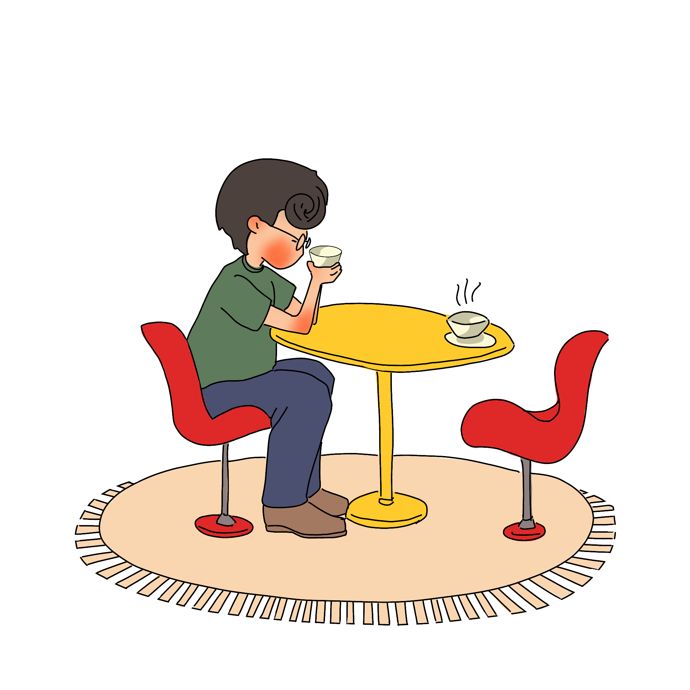
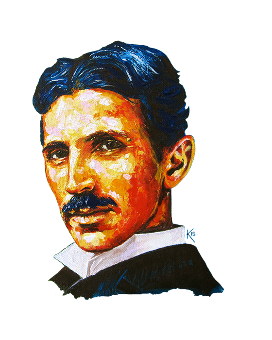

## La vie et les inventions de Nikola TeslaL'énigme Nikola Tesla

#### MENU

- [Accueil](index.html)
- [Biographie](page1.html)
- [Inventions et Héritage](page2.html)
- [Tableau des inventions](page3.html)
- [Vie personnelle](page4.html)
  - [Vie personnelle](#vie)
  - [Personnalité](#personalite)
  - [Tableau de comparaison](#tableau_edison)
- [Le décès de Tesla](page5.html)
- [Bibliographie](bibliographie.html)

[La vie personnelle de Nikola Tesla](#vie) orem ipsum dolor sit amet, consectetur adipiscing el. [Sa personnalité](#personalite) orem ipsum dolor sit amet, consectetur adipiscing el. [En comparaison avec Thomas Edison](#tableau_edison), Lorem ipsum dolor sit amet, consectetur adipiscing elit. Duis ut justo et velit volutpat efficitur. Donec in bibendum lacus, sed volutpat eros. Praesent auctor quam non bibendum venenatis. Curabitur vitae vestibulum turpis. Nunc aliquam sagittis magna sed consequat. Pellentesque habitant morbi tristique senectus et netus et malesuada fames ac turpis egestas.

### Vie personnelle

- Lorem ipsum dolor sit amet, consectetur adipiscing elit. Duis ut justo et velit volutpat efficitur. Donec in bibendum lacus, sed volutpat eros. Praesent auctor quam non bibendum venenatis. Curabitur vitae vestibulum turpis. Nunc aliquam sagittis magna sed consequat. Pellentesque habitant morbi tristique senectus et netus et malesuada fames ac turpis egestas.
- Lorem ipsum dolor sit amet, consectetur adipiscing elit. Duis ut justo et velit volutpat efficitur. Donec in bibendum lacus, sed volutpat eros. Praesent auctor quam non bibendum venenatis. Curabitur vitae vestibulum turpis. Nunc aliquam sagittis magna sed consequat. Pellentesque habitant morbi tristique senectus et netus et malesuada fames ac turpis egestas.
- Lorem ipsum dolor sit amet, consectetur adipiscing elit. Duis ut justo et velit volutpat efficitur. Donec in bibendum lacus, sed volutpat eros. Praesent auctor quam non bibendum venenatis. Curabitur vitae vestibulum turpis. Nunc aliquam sagittis magna sed consequat. Pellentesque habitant morbi tristique senectus et netus et malesuada fames ac turpis egestas.
- Lorem ipsum dolor sit amet, consectetur adipiscing elit. Duis ut justo et velit volutpat efficitur. Donec in bibendum lacus, sed volutpat eros. Praesent auctor quam non bibendum venenatis. Curabitur vitae vestibulum turpis. Nunc aliquam sagittis magna sed consequat. Pellentesque habitant morbi tristique senectus et netus et malesuada fames ac turpis egestas.

### Personnalité

- Lorem ipsum dolor sit amet, consectetur adipiscing elit. Duis ut justo et velit volutpat efficitur. Donec in bibendum lacus, sed volutpat eros. Praesent auctor quam non bibendum venenatis. Curabitur vitae vestibulum turpis. Nunc aliquam sagittis magna sed consequat. Pellentesque habitant morbi tristique senectus et netus et malesuada fames ac turpis egestas.
- Lorem ipsum dolor sit amet, consectetur adipiscing elit. Duis ut justo et velit volutpat efficitur. Donec in bibendum lacus, sed volutpat eros. Praesent auctor quam non bibendum venenatis. Curabitur vitae vestibulum turpis. Nunc aliquam sagittis magna sed consequat. Pellentesque habitant morbi tristique senectus et netus et malesuada fames ac turpis egestas.
- Lorem ipsum dolor sit amet, consectetur adipiscing elit. Duis ut justo et velit volutpat efficitur. Donec in bibendum lacus, sed volutpat eros. Praesent auctor quam non bibendum venenatis. Curabitur vitae vestibulum turpis. Nunc aliquam sagittis magna sed consequat. Pellentesque habitant morbi tristique senectus et netus et malesuada fames ac turpis egestas.
        
### Tableau de comparaison avec Edison

|          |   Nikola Tesla    |  Thomas Edison |
| :------------: | :-------------: | :-------------: |
| Date de naissance       |   10 juillet 1856     |     11 février 1847|
| Éducation   |   École polytechnique de Graz   |     École primaire et apprentissage en autodidacte |
|Relations professionnelles      |   Quitta la compagnie d'Edison en mauvais termes pour créer sa propre entreprise     |       Travailla avec Tesla avant de rompre leur relation professionnelle en raison de différences de philosophie |
|Relations personnelles     |   Correspondance régulière avec Mark Twain et Robert Underwood Johnson. A eu une brève relation amicale avec Edison.     |       A eu une brève relation amicale avec Tesla. |
|Inventions célèbres      |  Bobine Tesla, système polyphasé, rayon de la mort, télégraphe sans fil     |       Ampoule électrique, phonographe, kinétoscope |
|Philosophie      |  Intérêt pour l'électricité libre et l'énergie gratuite   |      Intérêt pour la propriété intellectuelle et les brevets |

> ##### Nikola Tesla
> Laissons l’avenir dire la vérité, et évaluer chacun en fonction de son travail et > de ses accomplissements. Le présent est à eux ; le futur, pour lequel j’ai
> réellement travaillé, est mien.

Les créateurs de ce site dédié à Nikola Tesla : Messai Koussaila et Sene Mamadou.
