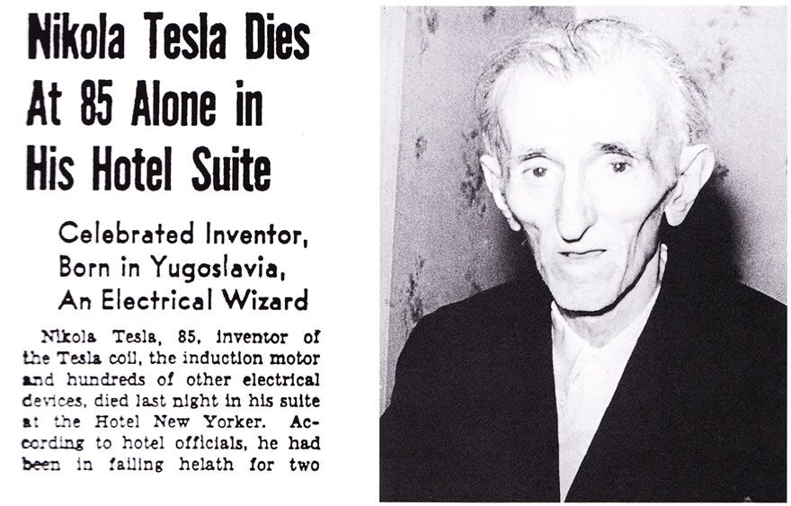

## La vie et les inventions de Nikola TeslaDécès de Nikola Tesla

#### MENU

- [Accueil](index.html)
- [Biographie](page1.html)
- [Inventions et Héritage](page2.html)
- [Tableau des inventions](page3.html)
- [Vie personnelle](page4.html)
- [Le décès de Tesla](page5.html)
  - [Son décès](#deces)
  - [Conclusion](#conclusion)
- [Bibliographie](bibliographie.html)

[Le décès](#deces) Lorem ipsum dolor sit amet, consectetur adipiscing elit. Duis ut justo et velit volutpat efficitur. Donec in bibendum lacus, sed volutpat eros. Praesent auctor quam non bibendum venenatis. Curabitur vitae vestibulum turpis. Nunc aliquam sagittis magna sed consequat. Pellentesque habitant morbi tristique senectus et netus et malesuada fames ac turpis egestas. [En fin de compte,](#conclusion) Nunc aliquam sagittis magna sed consequat. Pellentesque habitant morbi tristique senectus et netus et malesuada fames ac turpis egestas.

### Son décès

Lorem ipsum dolor sit amet, consectetur adipiscing elit. Duis ut justo et velit volutpat efficitur. Donec in bibendum lacus, sed volutpat eros. Praesent auctor quam non bibendum venenatis. Curabitur vitae vestibulum turpis. Nunc aliquam sagittis magna sed consequat. Pellentesque habitant morbi tristique senectus et netus et malesuada fames ac turpis egestas.

### Conclusion

Lorem ipsum dolor sit amet, consectetur adipiscing elit. Duis ut justo et velit volutpat efficitur. Donec in bibendum lacus, sed volutpat eros. Praesent auctor quam non bibendum venenatis. Curabitur vitae vestibulum turpis. Nunc aliquam sagittis magna sed consequat. Pellentesque habitant morbi tristique senectus et netus et malesuada fames ac turpis egestas.
+ bibendum lacus, sed volutpat eros. Praesent auctor quam non bibendum venenatis. Curabitur vitae vestibulum turpis. Nunc aliquam sagittis.
+ bibendum lacus, sed volutpat eros. Praesent auctor quam non bibendum venenatis. Curabitur vitae vestibulum turpis. Nunc aliquam sagittis. 
+ bibendum lacus, sed volutpat eros. Praesent auctor quam non bibendum venenatis. Curabitur vitae vestibulum turpis. Nunc aliquam sagittis. 

> ##### Nikola Tesla
> La plupart des personnes sont tellement absorbés dans la contemplation du monde
> extérieur qu'ils sont totalement inconscients de ce qui se passe en eux-mêmes. La mort prématurée de millions de personnes est principalement liée à cette cause.
> Même parmi ceux qui exercent leur attention, c'est une erreur commune pour éviter l'imagination et ignorer les dangers réels. Et ce qui est vrai d'un individu
> s'applique aussi, plus ou moins, à un peuple dans son ensemble.

Les créateurs de ce site dédié à Nikola Tesla : Messai Koussaila et Sene Mamadou.
